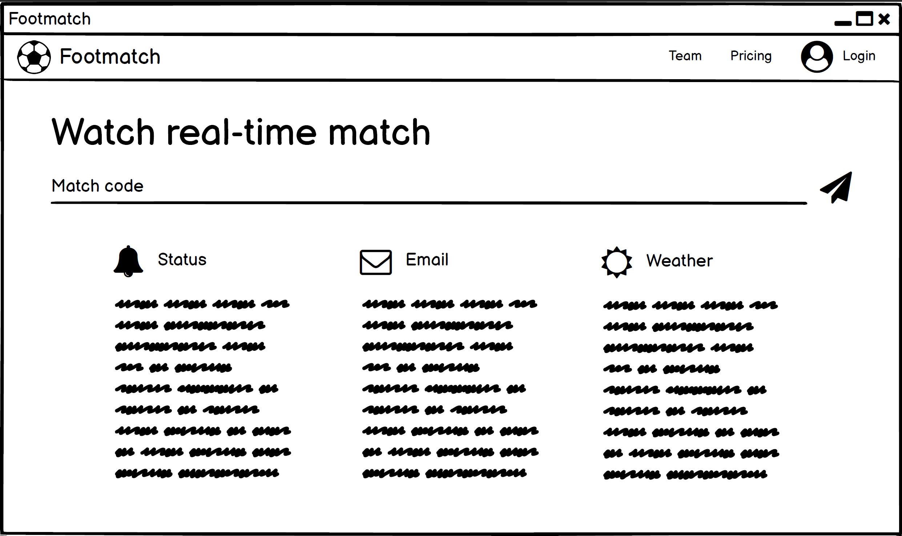
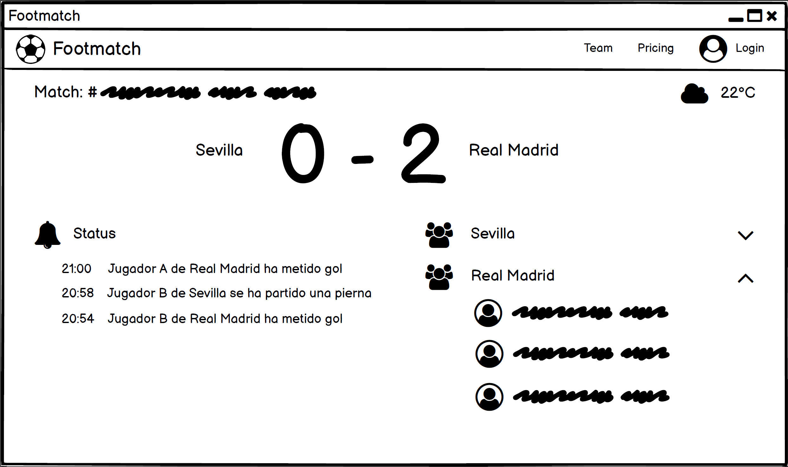
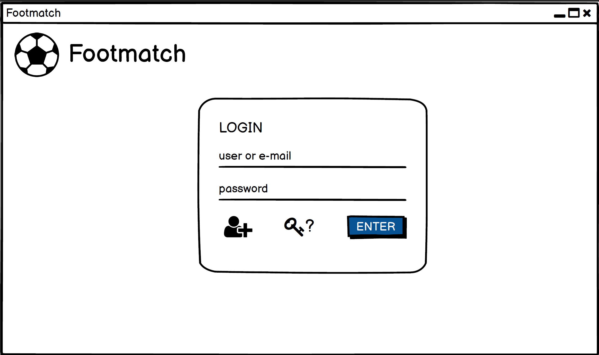
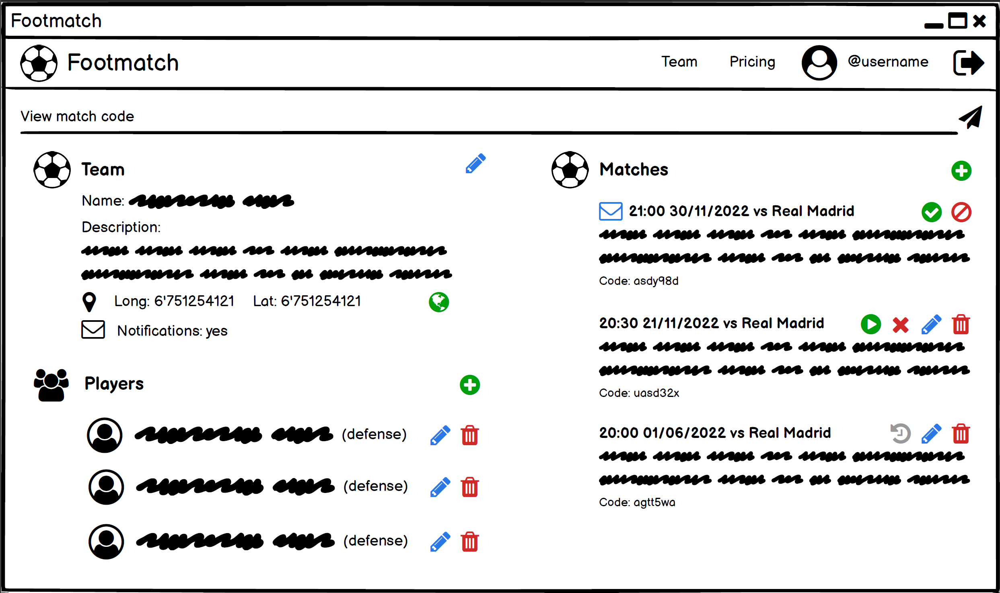
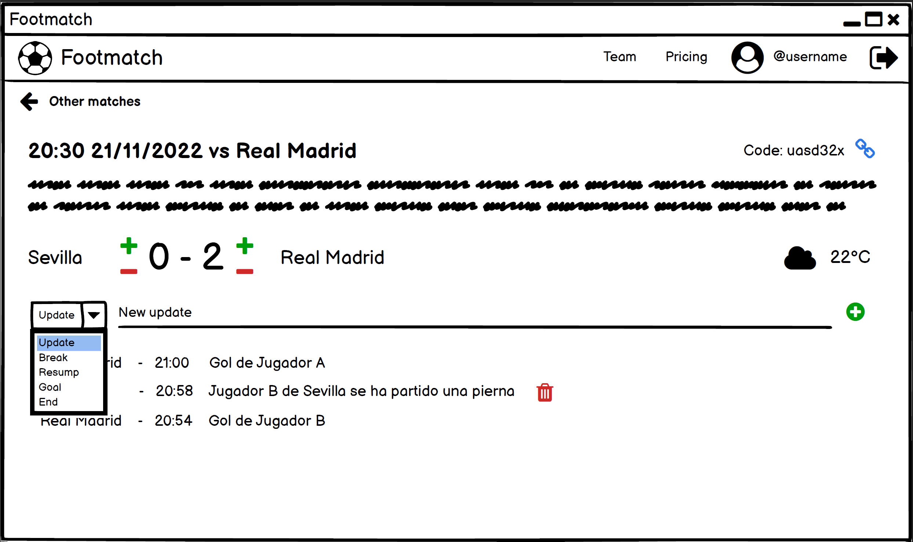
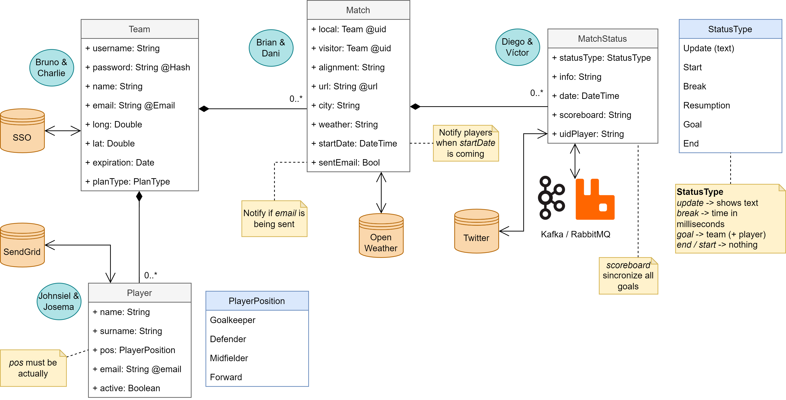
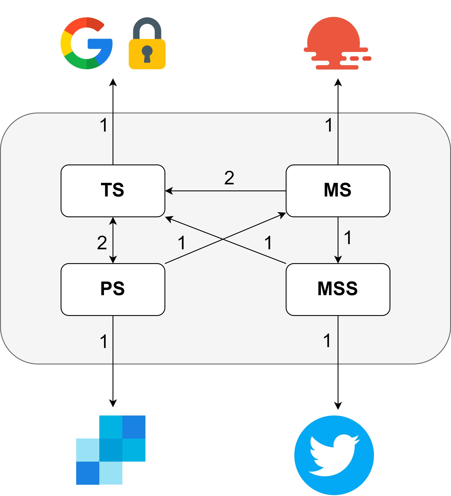
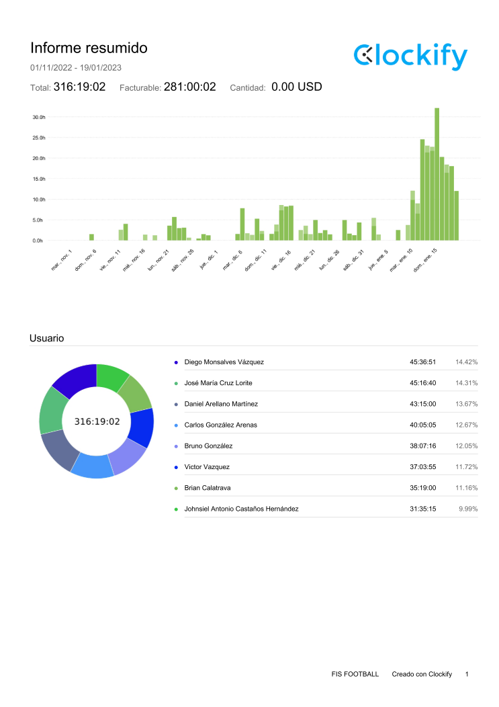

# Footmatch

## Introducción
Es una aplicación web que permite a los usuarios ver el estado en tiempo real de los partidos de fútbol de sus equipos favoritos. Con esta herramienta, los usuarios pueden obtener información en tiempo real sobre marcadores, lesiones, inicio/fin del contrato...
  

## Metodología
A continuación, se van a indicar los pasos realizados para la elaboración de este proyecto:

 1.  **Mockup**
Se trata de un prototipo de interfaz de usuario basado en UX (User eXperience) en el que se definirá las funcionalidades y el alcance de la aplicación. Este fichero se llama "*Mockup v3.pdf*" y está añadido en este repositorio.
*Nota: este no representará el diseño final, simplemente sirve como referencia y para concretar los requisitos lo antes posible.*

**Página principal**

**Visualizar partido**

**Login**

**Ver perfil**

**Editar estados del partido**

 2. **Diagrama de clases**
Se diseñará la estructura de microservicios en función con el análisis previo en el mockup. Para ello se usará un diagrama de clases UML, permitiendo representar así las entidades, relaciones y sus propiedades. Para simplificar la construcción de microservicios, se ha decidido optar por asociar un microservicio a cada entidad, y esta a su vez a una pareja.

*Nota: este no representará el diseño final, simplemente sirve como referencia y para concretar las entidades lo antes posible.*

 3. **Desarrollo**
En esta etapa se ha desarrollado los microservicios comenzando por el backend y terminando por el frontend.

4. **Documentación**
Se realiza la documentación asociada a los microservicios, documentación general, revisión de documentación previa en *Customer Agreements*, diapositivas y vídeo de demostración.

## Microservicios
A continuación, se explicará brevemente cada uno de los microservicios que compone la aplicación. Se indicará el enlace con la documentación y el enlace de SwaggerUI (documentación específica de la API).

### Team
Representa la entidad que gestiona los equipos. Estos permiten realizar operaciones sobre los jugadores, partidos y los estados. Integra la autenticación y autorización en función del plan dado. 
 - **Documentación**: https://github.com/Football-FIS/team-service
 - **API Rest**: https://team-service-danaremar.cloud.okteto.net/api/v1/docs/
 
Dentro del README del proyecto (https://github.com/Football-FIS/team-service/blob/main/README.md) se encuentra información sobre el nivel presentado y las distintas características implementadas, señalando en que partes del código pueden comprobarse.

### Player
Representa la entidad que gestiona los jugadores. Además, permitirá el envío de correos electrónicos informativos del partido a los jugadores a modo de recordatorio.
 - **Documentación**: https://github.com/Football-FIS/player-service
 - **API Rest**:

### Match
Representa la entidad que gestiona los partidos asociados a un equipo. Permite entre otras cosas la inicialización del envío de correos a los jugadores.
 - **Documentación**: https://github.com/Football-FIS/match-service
 - **API Rest**: https://match-service-danaremar.cloud.okteto.net/api/v1/docs/

### Match status
Representa el estado en el que se encuentra un partido. Este tipo de estados podrá ser tanto goles, inicio/finalización, tarjetas amarilla/roja, cambio de jugador u otros.
 - **Documentación**: https://github.com/Football-FIS/match-status-service
 - **API Rest**: https://match-status-service-danaremar.cloud.okteto.net/api/v1/docs/

## Términos y condiciones de Footmatch

### Introducción

Le rogamos que lea detenidamente las presentes Condiciones de Uso, ya que rigen el uso que usted haga de los servicios y contenidos proporcionados por Footmatch. Así mismo, al darse de alta en el servicio, aceptará los presentes términos y condiciones.

Para poder utilizar el servicio de Footmatch se requiere tener una edad mínima de 13 años (o la edad mínima equivalente en su país de origen) o contar con el consentimiento de sus padres o tutores legales.

### Duración del contrato
* Se garantiza un periodo mínimo de contrato de 2 años. Tras este periodo, podrán cambiarse las términos y condiciones siempre y cuando se avise al usuario.
* Si se cancela la subscripción, se podrá usar hasta su fecha de finalización.

### Licencia

Todo el software y/o servicios proporcionados son propiedad de Footmatch S.L. y queda totalmente restringido su uso por terceros y distribución.

### Servicio

#### Limitaciones

* Podrá interrumpirse la conexión en caso de que se detecte un uso fraudulento (suplantación de identidad, denegación de servicios...).
* Solamente se podrá aplicar la compra de un futuro plan.
 
#### Disponibilidad

Solamente se garantizará operatividad a los planes de pago, incluyendo las siguientes características:
* Premium: se garantizará una tasa de acierto de 95 cada 100 peticiones realizadas como promedio a lo largo de un mes.
* Enterprise: se garantizará una tasa de acierto de 99 cada 100 peticiones realizadas como promedio a lo largo de un mes.
En caso de incumplimiento, se abonará el siguiente mes de facturación.

### Modalidad de pago

Los pagos deberán realizarse mediante domiciliación bancaria, bajo un previo acuerdo mediante email en el que se indiquen los siguientes datos:
* Nombre y apellidos
* Plan de subscripción
* IBAN

### Pricing

Se ha decidido enfocar un modelo de pricing basado en SaaS, en el que las suscripciones son diferenciadas fundamentalmente por la funcionalidad.
 
No existirán periodos de prueba en los planes de pago.

| Características       | Free   |	Premium | Enterprise    |
|-----------------------|--------|----------|---------------|
| Precio                | Gratis | 5€/mes*  | 25€/mes *     |
| Jugadores máximos     | 16     | 25       | 50 jugadores  |
| Partidos / mes        | 2      | 4        | 10 partidos   |
| Peticiones API / seg  | 5      | 10       | 50            |
| Notificación Email    | NO     | SI       | SI            |
| Predicción del tiempo | NO     | NO       | SI            |
| SLA	                | NO     | NO       | SI            |
* Precio sin impuestos (dependerá del país de origen)

### Soporte

Se garantizará soporte a los planes de pago. Para ver más detalles consultar la siguiente tabla:
 
#### Características

| Características       | Free   |	Premium | Enterprise       |
|-----------------------|--------|----------|------------------|
| Tipo de contacto      | N/A    | email    | sms/email        |
| Tiempo de respuesta   | N/A    | 3 días   | 1 días           |
 
En caso de incumplimiento, se abonará el siguiente mes de facturación.

#### Problemas y disputas

Podrá suspenderse el acceso al servicio Footmatch en cualquier momento si consideramos que ha incumplido las condiciones del servicio, avisando previamente al usuario mediante su correo electrónico.

#### Contacto

Podrá ponerse en contacto mediante:
* Email: footmatch@gmail.com
* Teléfono: +34 666 777 888

### Cambios

Se podrán establecer cambios en el precio o en los términos / condiciones del servicio, siempre y cuando se envié un correo electrónico indicando los cambios y estos sean publicados.

## Análisis de capacidad
En este apartado, se analizará la capacidad del conjunto de los microservicios implementados.

Para ello, se segmentará el proceso en diferentes pasos:

 1. **Representación de servicios**
Se representarán los servicios y sus relaciones para visualizar las peticiones que se generan en cada API por cada una de las peticiones del usuario. Esto servirá de ayuda visual para el siguiente paso.

 2. **Cálculo peticiones a las APIs / petición del usuario**
Se determina el número de peticiones a las respectivas APIs para cada petición / acción realizada por el usuario. 

| Caso de uso      | SSO | OW | TW | SG | Total |
| ---------------- | --- | -- | -- | -- | ----- |
| Consulta partido | 0   | 1  | 0  | 0  | 1     |
| Autentificación  | 1   | 0  | 0  | 0  | 1     |
| Perfil           | 1   | 0  | 0  | 0  | 1     |
| GET TS           | 1   | 0  | 0  | 0  | 1     |
| ADD TS           | 1   | 0  | 0  | 0  | 1     |
| PUT TS           | 1   | 0  | 0  | 0  | 1     |
| DEL TS           | 1   | 0  | 0  | 0  | 1     |
| GET PS           | 1   | 0  | 0  | 0  | 1     |
| ADD PS           | 1   | 0  | 0  | 0  | 1     |
| PUT PS           | 1   | 0  | 0  | 0  | 1     |
| DEL PS           | 1   | 0  | 0  | 0  | 1     |
| GET MSS          | 1   | 0  | 1  | 0  | 2     |
| ADD MSS          | 1   | 0  | 0  | 0  | 1     |
| PUT MSS          | 1   | 0  | 0  | 0  | 1     |
| DEL MSS          | 1   | 0  | 0  | 0  | 1     |
| GET MS           | 1   | 0  | 0  | 0  | 1     |
| ADD MS           | 1   | 0  | 0  | 0  | 1     |
| PUT MS           | 1   | 0  | 0  | 0  | 1     |
| DEL MS           | 1   | 0  | 0  | 0  | 1     |
| Info partido     | 1   | 1  | 0  | 0  | 2     |
| CRON             | 0   | 0  | 0  | 1  | 1     |
| Total            | 19  | 2  | 1  | 1  | 23    |

 3. **Análisis por API**
Se analizan el tipo de plan que se pretende obtener, así como el número máximo de llamadas por segundo y su precio fijo (precio variable no tenemos). 

| API   | Req. max. | Plan        | Precio base | Req. Max. API |
| ----- | --------- | ----------- | ----------- | ------------- |
| SSO   | 19        | Free        | 0           | 10000         |
| OW    | 2         | Profesional | 410         | 761           |
| TW    | 1         | Standard    | 0           | 1000000       |
| SG    | 1         | Essential   | 34,95       | 896           |
| Total | 23        |             | 444,95      |               |

 4. **Crear supuestos**
Se van a hacer suposiciones para cada plan acerca del número de peticiones máximos, precio y número de usuarios que van a usar la aplicación. Esto estará relacionado con el acuerdo de nivel de servicio.

| Plan       | Req/max | Precio | Nº usuarios   | € total |
| ---------- | ------- | ------ | ------------- | ------- |
| Free       | 5       | 0      | 150           | 0       |
| Premium    | 10      | 5      | 60            | 300     |
| Enterprise | 50      | 25     | 20            | 500     |

Además, para cada API se va a suponer un nivel de riesgo:

| API | Riesgo |
| --- | ------ |
| SSO | 85%    |
| OW  | 85%    |
| TW  | 0%     |
| SG  | 65%    |

*Nota: se ha analizado el peor peor caso (se realizan todas las peticiones posibles a la vez por usuario), por lo que suponer un 85% de riesgo no implica ningún disparate.*

 5. **Determinar la capacidad máxima de usuarios por plan**
Para los datos anteriores se extraerá el máximo número de usuarios posibles en caso de que solamente existiese ese plan.

| API  | Free        | Premium     | Enterprise  |
|------|-------------|-------------|-------------|
| SSO  | 701,754386  | 350,877193  | 70,1754386  |
| OW   | 507,3333333 | 253,6666667 | 50,73333333 |
| TW   | 200000      | 100000      | 20000       |
| SG   | 512         | 256         | 51,2        |
| Mín. | 507         | 253         | 50          |

*Nota: se ha usado el siguiente cálculo: 
nº pet. máx. API / pet. a la API por pet. del usu. / (1- riesgo) / nº máx. pet. por plan usu.*

 6. **Estudio de viabilidad de los supuestos**
En esta ocasión vamos a suponer al contrario, con el supuesto del número de usuarios se va a calcular el número máximo de peticiones que recibirá cada API.
Tras el cálculo, podrá observarse que el número de peticiones total es inferior al máximo soportado por la API.

| API   | Req. Free | Req. Premium | Req. Enterprise | Req. total |
|-------|-----------|--------------|-----------------|------------|
| SSO   | 2137,5    | 1710         | 2850            | 6697,5     |
| OW    | 225       | 180          | 300             | 705        |
| TW    | 750       | 600          | 1000            | 2350       |
| SG    | 262,5     | 210          | 350             | 822,5      |
| Total | 3375      | 2700         | 4500            | 10575      |

*Nota: se ha usado el siguiente cálculo: 
nº usuarios * pet. a la API por pet. del usu. * (1- riesgo) * nº máx. pet. por plan usu.*

 7. **Análisis de beneficios**
Se determinará el beneficio tras el uso de los datos supuestos. Se calcula como la diferencia entre ingresos (multiplicación de número de usuarios y precio por cada uno) y gastos (coste de las 2 APIs que requieren pagos).
*Ingresos = Beneficio - Gastos = 800 - 444,95 = **+355,05€***
  

## Determinar coste por plan

En este punto vamos a dar una métrica que te permita saber cuanto nos cuesta las request por usuario en cada uno de los planes.

| Plan       | Req/max | Precio | Nº usuarios   | € total |
| ---------- | ------- | ------ | ------------- | ------- |
| Free       | 5       | 0      | 150           | 0       |
| Premium    | 10      | 5      | 60            | 300     |
| Enterprise | 50      | 25     | 20            | 500     |

1. Determinar el número de  peticiones totales por cada tipo de usuario.
-   Free: 750 Req (5 x 150)
-   Premium: 600 Req  (10 x 60)
-   Enterprise: 1.000 Req  (50 x 20)

2. La suma de todos los request da el 100% de las peticiones. Haciendo regla de 3 con cada uno de los planes, se consigues saber el número total de peticiones máximas posibles.
- Req totales: 2.350 Req  -> (100%)
- Free: 750 Req / 2.350 Req x 100% = 32,2% de las peticiones totales
- Premium: 600 Req / 2.350 Req x 100% = 25,5% de las peticiones totales
- Enterprise: 1.000 Req / 2.350 Req x 100% = 42,3% de las peticiones totales

3. Al ya tener el máximo número de peticiones posibles y el máximo número de peticiones de cada plan, haciendo regla de tres con el coste del 100% de las request se puedes calcular el de cada plan. Y esto dividirlo entre el usuario.
-   Free: 750 Req / 2.350 Req x 0 € = 0 €
-   Premium: 600 Req / 2.350 Req x 300 € = 76,595 €
-   Enterprise: 1.000 Req / 2.350 Req x 500 € = 213,829 €

Entonces, para calcular el coste por usuario:
-   Free: 0 € / 150 usuarios = 0 € por usuario
-   Premium: 76,595 € / 60 usuarios = 1,27 € por usuario
-   Enterprise: 213,829 € / 20 usuarios = 10,69 € por usuario

Así con esta información podemos ver cuánto cuesta por usuario en cada plan.

## Cómputo de horas
<<<<<<< HEAD
=======

>>>>>>> feat-005-Costes

El proyecto ha tardado un poco más de lo previsto debido a varios factores. En primer lugar, el desconocimiento del uso de algunas tecnologías como puede ser Django o Angular junto a otras herramientas. Además, se han producido errores imprevistos que han requerido tiempo adicional para resolverlos de forma efectiva. También ha habido problemas con el despliegue en Okteto. Sin embargo, a pesar de estos problemas, se ha logrado completar el proyecto con éxito dentro del plazo de entrega.

*Nota: Esto es un informe resumido, para el informe completo consultar el Clockify_Tiempo_Detallado.pdf*

## Conclusiones
<<<<<<< HEAD

En conclusión, este proyecto ha sido una gran oportunidad para aprender y aplicar nuevas tecnologías en el desarrollo de una aplicación web. A lo largo del proceso, hemos aprendido a utilizar tecnologías como Django o Flask para el Backend, Angular junto a Tailwind para el Frontend, MongoDB como base de datos NoSQL y Github como gestor de código. Así como la utilización de otras herramientas relevantes y novedosas para algunos de nosotros como Makefile o ElectronJS.

Hemos aprendido a desarrollar un microservicio desde cero, lo que ha permitido tener una arquitectura de microservicios en función del análisis previo en el mockup. Esto ha sido clave para poder dividir el proyecto en diferentes partes y poder trabajar de manera más eficiente y escalable.

Además, hemos aprendido a trabajar en equipo, a comunicarnos de manera efectiva y a colaborar en un repositorio de código de manera ordenada y estructurada. También hemos aprendido a documentar todo el proceso para facilitar su comprensión. Posiblemente todas estas cosas, las acabaremos utilizando tarde o temprano en proyectos venideros.

En general, este proyecto ha sido una gran oportunidad para ampliar nuestras habilidades en el desarrollo de aplicaciones web y para adquirir nuevos conocimientos en el ámbito de las tecnologías de la información. Sin duda, estos conocimientos y habilidades serán de gran utilidad en nuestra futura carrera profesional.

=======
>>>>>>> feat-005-Costes
